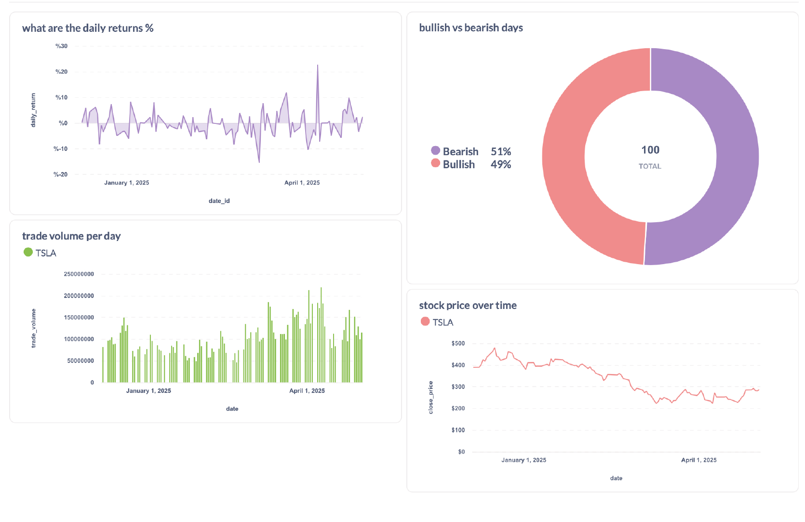

# Full-Stack Stock Market Data Pipeline (Airflow, Spark, PostgreSQL, Metabase)

## Project Overview:

This project is an end-to-end data pipeline that extracts stock market data from multiple external APIs, transforms and enriches it using Apache Spark, stages and warehouses the data in PostgreSQL, and visualizes insights through Metabase.

The workflow is fully orchestrated using Airflow and runs in a Dockerized environment for easy deployment.

Data Modeling:

Designed and implemented a star-schema data warehouse consisting of a fact table (fact_stock_prices) and two dimension tables (dim_stock, dim_date). Referential integrity is enforced through foreign keys and optimized for analytical querying. 

Tech Stack:

- Multiple APIs (multi-source ingestion)
- Airflow (orchestration)
- Spark 
- Postgres staging & Postgres warehouse (proper ELT modeling)
- Metabase (visualization)
- Docker Compose (local infra)

 ## Pipeline Flow
1. Airflow DAG extracts raw company and financial data from two different APIs into staging zone (PostgreSQL).
2. Spark job reads staging & transforms data (cleans and enriches)
3. Spark loads data to a landing table
4. airflow moves data from landing table to warehouse schema in PostgreSQL populating final “fact tables” and “dimension tables”
5. Metabase connects directly to the warehouse to create dashboards: trends, stock performance analytics, volatility insights, etc.

## How to Run
    docker-compose up --build
- Access Airflow: http://localhost:8888
- Access Metabase: http://localhost:3000
